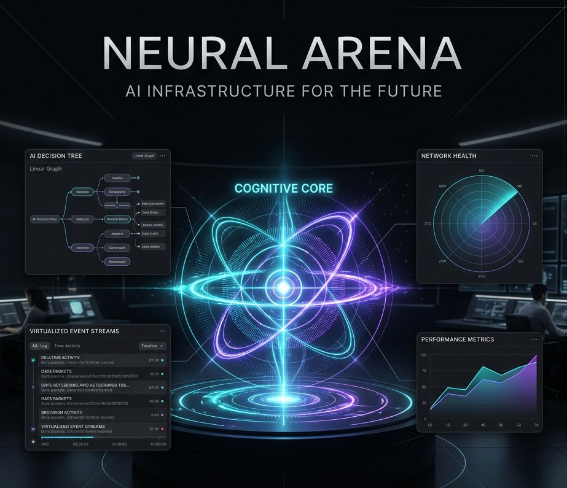

<div align="center">

# Neural Arena

### Deterministic Autonomous Cognition Observatory & Benchmarking Platform

[](LICENSE)
[](CHANGELOG.md)
[]()
[]()

*Watch autonomous AI systems think, adapt, and compete — in real time.*
*Every decision traceable. Every simulation replayable. Every observation verifiable.*



---

[Getting Started](#getting-started) · [Architecture](#architecture-overview) · [How It Works](#how-neural-arena-works) · [Documentation](#documentation) · [Roadmap](#roadmap)

</div>

---

## What is Neural Arena?

Neural Arena is a **deterministic autonomous cognition observatory** — a local-first platform for running, observing, benchmarking, and replaying autonomous multi-agent AI simulations in real time.

It is not a chatbot. It is not an AI toy. It is not a game.

Neural Arena is **Mission Control for autonomous AI systems**.

You configure autonomous agents, connect them to any OpenAI-compatible LLM provider (NVIDIA, OpenAI, local models), and launch a fully deterministic simulation where agents interact, strategize, fail, adapt, and evolve — all while you observe the entire cognitive process through a premium real-time dashboard.

Every event is immutable. Every simulation is fully replayable. Every decision is traceable to its causal root. Every benchmark is reproducible.

### What Makes This Different

| Traditional AI tools | Neural Arena |
|---|---|
| Black-box outputs | Full cognition observability |
| Non-deterministic behavior | Deterministic, replayable simulations |
| Single model evaluation | Multi-agent autonomous interaction |
| Manual testing | Automated benchmarking with scoring |
| Opaque decision making | Causal event chains with intent tracking |
| Cloud-dependent | Local-first, privacy-respecting |

---

## Why This Project Exists

The AI industry has a critical observability gap.

We can build increasingly powerful language models, but we have almost no infrastructure for **watching them think autonomously**. We can evaluate models with static benchmarks, but we cannot observe how they behave as **autonomous decision-making agents** interacting with dynamic environments over time.

Neural Arena exists to close that gap.

It provides the infrastructure to:

1. **Observe** autonomous AI cognition in real time — not just outputs, but the full decision pipeline
2. **Replay** any simulation tick-by-tick with guaranteed deterministic reconstruction
3. **Benchmark** autonomous behavior with domain-agnostic scoring that measures decision quality, adaptation, consistency, and hallucination resistance
4. **Compare** models not by static benchmarks, but by their autonomous behavior under real orchestration pressure
5. **Trust** the results, because every claim is backed by an immutable event log with causal provenance

Chess serves as the first simulation domain — a contained, well-understood environment with clear rules, verifiable legality, and deep strategic depth. But Neural Arena's architecture is **domain-agnostic**. The deterministic runtime, event sourcing, cognition pipeline, and benchmark systems have no chess-specific knowledge. Future domains — negotiations, debates, research swarms, strategic planning — plug into the same infrastructure.

---

## Core Capabilities

### Deterministic Runtime Engine

The foundation of Neural Arena is a **tick-based deterministic simulation runtime** built on immutable event sourcing.

- **EventBus** — The central nervous system. Every state change flows through the EventBus as an immutable event with a deterministic ID, monotonic sequence number, simulation tick, and causal parent reference.
- **EventStore** — Append-only immutable event log. Events are deep-cloned and deep-frozen on write. The EventStore is the single source of truth — the complete history of everything that happened.
- **WorldStateTree** — A Merkle-like tree of SHA-256-hashed game states. Every state transition creates a new frozen node linked to its parent. Supports branching, rollback, and both hash-based and deep structural diffing.
- **SimulationClock** — Strictly separated dual-time architecture: *simulation time* is deterministic (derived purely from `tick × tickRate`, never reads the system clock) and *wall-clock time* is monotonic (used only for observability, never for simulation logic). This separation is the foundation of replay correctness.
- **IntentGateway** — The single entry point for all agent actions. Validates intents, assigns deterministic IDs, manages priority queues, and tracks lifecycle state transitions.

**Invariant**: Given event log `E` and cursor position `c`, `replayToIndex(E, c)` always produces identical state `S`. This guarantee is enforced by immutable events, deterministic IDs, pure state reconstruction, and the complete absence of wall-clock dependencies in simulation logic.

### Cognition Pipeline

Neural Arena doesn't just send prompts to models and hope for the best. It runs a **multi-stage cognitive pipeline** that compiles context, selects strategies, and adapts to model behavior in real time.

```
ContextCompiler → AdaptivePromptStrategy → PromptCompiler → Provider → AntiCheat → IntentGateway
```

- **ContextCompiler** — Assembles a structured Cognitive Context Matrix from independent blocks: PersonaBlock (agent identity and risk profile), WorldStateBlock (current simulation state), TacticalMemoryBlock (previous failures, rejected moves, escalation level), RetrievalBlock (future RAG integration), ConstraintBlock (output schema, legality constraints, anti-cheat requirements), and LegalMovesBlock.
- **ModelCapabilityRegistry** — Runtime classification of model cognitive capabilities (TINY, SMALL, MEDIUM, LARGE, REASONING) based on model identification and runtime failure profile analysis.
- **AdaptivePromptStrategy** — Dynamically selects prompt strategies based on model tier and correction history. Modes include STANDARD, MINIMAL_DETERMINISTIC, STRICT_CORRECTION, FORCED_CONSTRAINED, and WEAK_SIMPLE.
- **PromptCompiler** — Renders the Cognitive Context Matrix into model-appropriate prompts. Adapts formatting (numbered lists vs bullets vs inline), constraint strictness, and persona detail based on strategy selection.
- **TacticalMemory** — Per-agent memory tracking rejected moves, correction patterns, escalation levels, and repeated failure analysis. Feeds back into the ContextCompiler to prevent repeated errors.
- **CognitiveCorrection** — When a model produces an invalid output, the correction system injects failure context into the next prompt ("Your move was rejected because...") with escalating constraint severity.

### Multi-Agent Orchestration

- **TurnOrchestrator** — Manages the core simulation loop: cooldown → prompt → API call → anti-cheat → validate → apply. Handles adaptive cooldowns based on provider health, intelligent retry logic, and immediate forfeit for non-retryable errors.
- **ProviderTracker** — Per-agent provider health tracking with failure classification (AUTH, RATE_LIMIT, TIMEOUT, SERVER, PARSE, MOVE), exponential backoff, and retry advisories.
- **AntiCheatPipeline** — Multi-gate validation: JSON parsing, schema validation, move extraction, format normalization, and domain-specific legality checking.
- **AgentManager** — Agent lifecycle management, display name resolution, and configuration.

### Replay Engine

Every Neural Arena simulation is **fully replayable** from its event log alone.

- **Deterministic Reconstruction** — The replay engine uses a pure function `replayToIndex(events, cursor)` that reconstructs exact world state at any point. No external state needed. Two independent clients loading the same replay file produce identical visualizations at every cursor position.
- **Timeline Scrubbing** — Drag the scrubber to any point in the simulation timeline. Move markers show exact positions where agent actions were accepted.
- **Variable Speed Playback** — 0.5×, 1×, 2×, 4× playback with step-forward and step-backward controls.
- **Export/Import** — Complete event logs exportable as `.neural-arena.json` files. Import any replay to reconstruct the full simulation.
- **Replay Library** — Auto-saved sessions with search, sort, tags, and management. Browse your simulation history like a research archive.

### Mission Control Dashboard

The real-time dashboard is designed as **Mission Control for autonomous AI systems** — not a toy interface, not a gamer dashboard.

Visual direction: Apple Intelligence × Linear × Bloomberg Terminal × NASA Mission Control.

- **CognitiveCore** — A living SVG visualization at the center of the dashboard that breathes with the runtime state. Orbital rings, energy pulses, and activity patterns are all derived from actual backend state — never random.
- **CognitionPipeline** — Real-time 4-stage processing flow showing context compilation, strategy selection, provider communication, and validation progress.
- **Agent Cognition Panels** — Per-agent cards showing lifecycle state, thinking indicators, intent history, and breathing animations synchronized to cognition state.
- **Telemetry Chart** — Live event rate, cognition timing, and error tracking with Recharts area visualization.
- **Event Stream** — Virtualized, filtered event log handling 500+ events at 60fps with category filtering (World, Agent, Provider, System, Error, Cognition).
- **Move History** — Tabular turn history with agent identification and timing.
- **Runtime Diagnostics** — System health bars, lifecycle state, cognition heat, error pressure, and uptime.
- **Simulation Controls** — Dual-mode control dock: Live mode (start/pause/resume/stop/export) and Replay mode (play/pause/step/speed/scrub/import).

### Provider Abstraction

Neural Arena works with any OpenAI-compatible API endpoint:

- **NVIDIA NIM** — Tested extensively with Gemma, LLaMA, and other NVIDIA-hosted models
- **OpenAI** — GPT-4o, GPT-4, GPT-3.5
- **Local Models** — Any OpenAI-compatible server (Ollama, vLLM, text-generation-webui)
- **System Role Fallback** — Automatic detection and handling of providers that don't support the `system` role, with transparent folding of system instructions into user messages

### Ethical Telemetry

Neural Arena is built with a **trust-first** approach to data:

- **Local-only by default** — All simulation data stays on your machine
- **Opt-in anonymous telemetry** — If you choose to share, you see exactly what gets collected before anything leaves your device
- **Never collected** — API keys, secrets, prompts, local files, personal information, unrelated system data
- **Inspectable** — Full telemetry preview panel showing the exact anonymized packet
- **Revocable** — Consent can be withdrawn at any time, with full data deletion

See [TELEMETRY_AND_PRIVACY.md](docs/TELEMETRY_AND_PRIVACY.md) for exhaustive detail.

### Benchmark Architecture

Neural Arena's benchmarking is **domain-agnostic**. The scoring system measures autonomous cognition quality independent of the simulation domain:

- **Decision Quality** — Percentage of agent intents accepted by the validation system
- **Adaptation Score** — Efficiency of the escalation and correction pipeline
- **Consistency Score** — Stability of agent behavior patterns over time
- **Hallucination Rate** — Percentage of invalid, illegal, or malformed outputs
- **Response Time** — Average provider latency rounded to nearest 10ms for anonymity

Domain-specific scoring (e.g., chess material analysis) lives in pluggable adapters, not the core system.

See [BENCHMARKING.md](docs/BENCHMARKING.md) for full methodology.

---

## How Neural Arena Works

### The Simulation Lifecycle

```
1. CONFIGURE
   User selects agents, providers, and runtime preset.
   Provider profiles are loaded from saved configurations.

2. BOOT
   Runtime initializes: EventBus, EventStore, SimulationClock,
   WorldStateTree, IntentGateway, ProviderTrackers.
   Socket.IO transport connects dashboard to runtime.

3. SIMULATE
   TurnOrchestrator runs the deterministic tick loop:
   
   ┌─────────────────────────────────────────────────────────┐
   │  for each turn:                                         │
   │    1. Adaptive cooldown (provider health-based)         │
   │    2. ContextCompiler assembles Cognitive Context Matrix │
   │    3. AdaptivePromptStrategy selects prompt mode         │
   │    4. PromptCompiler renders model-appropriate prompt    │
   │    5. Provider API call with timeout                     │
   │    6. AntiCheat pipeline (JSON → schema → move → legal) │
   │    7. Intent submission to IntentGateway                 │
   │    8. World state update via WorldStateTree              │
   │    9. EventBus emits immutable events                    │
   │   10. Dashboard receives events via Socket.IO            │
   │                                                          │
   │  On failure: CognitiveCorrection → retry with context    │
   │  On repeated failure: Escalation → simpler prompt mode   │
   │  On non-retryable error: Immediate forfeit               │
   └─────────────────────────────────────────────────────────┘

4. OBSERVE
   Mission Control dashboard displays:
   - Real-time event stream
   - Cognition pipeline progress
   - Agent lifecycle and thinking state
   - Telemetry charts
   - Move history
   - Living CognitiveCore visualization

5. TERMINATE
   Game-over detected (checkmate, stalemate, draw, forfeit, timeout).
   Session auto-saved to replay library.
   Benchmark scores computed.

6. REPLAY
   Any completed simulation can be replayed from its event log.
   Deterministic reconstruction guarantees identical state at every cursor position.
```

### Why Determinism Matters

In a non-deterministic system, you can observe behavior, but you can never **prove** it. You see an outcome, but you cannot reconstruct the exact sequence of decisions that produced it. You notice a bug, but you cannot reliably reproduce it. You compare two runs, but you cannot guarantee they started from the same conditions.

Neural Arena's deterministic guarantees change this fundamentally:

1. **Reproducibility** — Given the same event log, you always get the same state. No exceptions.
2. **Debugging** — When something unexpected happens, you can scrub to the exact tick, inspect the exact world state, and trace the exact causal chain that led to it.
3. **Benchmarking** — Results are reproducible. If Agent A scores 0.87 decision quality in a replay, anyone loading that same replay will compute the same score.
4. **Trust** — Users and researchers can independently verify any claim about simulation behavior by loading the event log.
5. **Research** — Deterministic simulations enable controlled experiments. Change one variable, replay, and observe the difference.

### Why Replayability Matters

Replayability is not just a feature — it is an **architectural commitment**.

Every component in Neural Arena is designed around the assumption that any simulation will eventually be replayed. This means:

- **No hidden state** — All state flows through the EventBus/EventStore. There are no side channels, no local variables that affect outcomes, no state that exists outside the event log.
- **No wall-clock dependencies** — Simulation time is derived purely from `tick × tickRate`. The SimulationClock explicitly separates deterministic simulation time from observability-only wall-clock time.
- **No random generators in state computation** — The replay engine's `replayToIndex()` function is pure. It produces identical output for identical input, every time.
- **Causal provenance** — Every event carries a `causedByEventId` reference, enabling full causal chain reconstruction from any point in the simulation.

### Autonomous Cognition Observability

Traditional AI evaluation answers: "Did the model get the right answer?"

Neural Arena answers a deeper question: **"How did the model think?"**

Through the Cognitive Context Matrix, you can observe:
- What information the agent received (WorldStateBlock, TacticalMemoryBlock)
- How its persona and risk profile were configured (PersonaBlock)
- What constraints were imposed (ConstraintBlock)
- What strategy was selected and why (AdaptivePromptStrategy)
- How the prompt was rendered for the specific model tier (PromptCompiler)
- Whether corrections were applied from previous failures (CognitiveCorrection)
- Whether provider compatibility fallbacks were triggered (system role folding)

This level of observability enables genuine understanding of autonomous AI behavior — not just evaluation of outcomes.

---

## Architecture Overview

```
┌───────────────────────────────────────────────────────────────────┐
│                      Mission Control Dashboard                    │
│  ┌───────────┐ ┌────────────┐ ┌───────────┐ ┌──────────────────┐ │
│  │ Cognitive  │ │ Cognition  │ │ Telemetry │ │ Replay Engine    │ │
│  │ Core       │ │ Pipeline   │ │ & Charts  │ │ & Timeline       │ │
│  │ (Living    │ │ (4-stage   │ │ (Recharts │ │ (Deterministic   │ │
│  │  SVG)      │ │  display)  │ │  area)    │ │  reconstruction) │ │
│  └───────────┘ └────────────┘ └───────────┘ └──────────────────┘ │
│  ┌───────────┐ ┌────────────┐ ┌───────────┐ ┌──────────────────┐ │
│  │ Agent      │ │ Event      │ │ Move      │ │ Runtime          │ │
│  │ Cognition  │ │ Stream     │ │ History   │ │ Diagnostics      │ │
│  │ Panels     │ │ (Virtual)  │ │           │ │                  │ │
│  └───────────┘ └────────────┘ └───────────┘ └──────────────────┘ │
│  State: useDashboardStore | useReplayStore | useReplayLibrary    │
├───────────────────────────────────────────────────────────────────┤
│                    Socket.IO Transport Layer                      │
│  RuntimeController ←→ SocketClient (reconnect + backoff)         │
├───────────────────────────────────────────────────────────────────┤
│                    Deterministic Runtime Engine                   │
│  ┌────────────┐ ┌────────────┐ ┌──────────────┐ ┌─────────────┐ │
│  │ EventBus   │ │ EventStore │ │ WorldState   │ │ Simulation  │ │
│  │ (pub/sub   │ │ (append-   │ │ Tree         │ │ Clock       │ │
│  │  backbone) │ │  only log) │ │ (SHA-256     │ │ (dual-time) │ │
│  │            │ │            │ │  Merkle)     │ │             │ │
│  └────────────┘ └────────────┘ └──────────────┘ └─────────────┘ │
│  ┌────────────┐ ┌────────────┐ ┌──────────────┐ ┌─────────────┐ │
│  │ Cognition  │ │ Intent     │ │ Turn         │ │ Provider    │ │
│  │ Pipeline   │ │ Gateway    │ │ Orchestrator │ │ Abstraction │ │
│  │ (Context + │ │ (validate  │ │ (adaptive    │ │ (multi-     │ │
│  │  Strategy) │ │  + queue)  │ │  retry)      │ │  provider)  │ │
│  └────────────┘ └────────────┘ └──────────────┘ └─────────────┘ │
└───────────────────────────────────────────────────────────────────┘
```

For exhaustive architectural detail, see [ARCHITECTURE.md](docs/ARCHITECTURE.md).

---

## Getting Started

### Prerequisites

- **Node.js** 18+ (LTS recommended)
- **npm** 9+
- An API key from any OpenAI-compatible provider (NVIDIA NIM, OpenAI, local model server)

### Installation

```bash
# Clone the repository
git clone https://github.com/neural-arena/neural-arena.git
cd neural-arena

# Install dependencies
npm install

# Launch the development environment
npm run electron:dev
```

This starts both the backend runtime and the Mission Control dashboard. Open `http://localhost:5173` in your browser, or use the Electron window.

### First Run

On first launch, the **Onboarding Wizard** will guide you through:

1. **Welcome** — Introduction to the platform
2. **Provider Setup** — Enter your API key, base URL, and model
3. **Preferences** — Select a runtime preset and privacy settings
4. **Launch** — Review configuration and start

### Running a Simulation

1. Configure both agents on the Setup Screen (model, API key, display name)
2. Select a runtime preset or customize timeout settings
3. Click **Launch Runtime**
4. Watch the Mission Control dashboard come alive:
   - The CognitiveCore pulses with runtime activity
   - The CognitionPipeline shows each processing stage
   - Events stream in real time
   - Telemetry charts update continuously
5. When the match ends, results are auto-saved to the Replay Library

### Runtime Presets

| Preset | Timeout | Description |
|---|---|---|
| ⚡ Rapid Benchmark | 30s | Fast evaluation, speed-focused |
| ⚖️ Balanced Analysis | 120s | Standard simulation, full pipeline |
| 🔬 Deep Analysis | 300s | Extended cognition, thorough evaluation |
| 🏋️ Endurance Test | 600s | Stress testing, high retry tolerance |
| 🎬 Quick Demo | 60s | Fast results, demonstration mode |

### Building for Distribution

```bash
# Build everything (TypeScript backend + Vite dashboard)
npm run build:release

# Package Windows installer (NSIS + portable)
npm run electron:package
```

Output: `release/` directory with installer and portable executable.

---

## Technical Philosophy

### 1. Determinism Over Convenience

Every design decision prioritizes deterministic correctness over developer convenience. If a feature cannot be made deterministic, it is either redesigned or excluded from the simulation path.

### 2. Immutability Over Mutation

Events are append-only and deep-frozen. State nodes are frozen. Cognitive context matrices are frozen. There is no in-place mutation anywhere in the simulation pipeline.

### 3. Observability Over Opacity

If something happens inside the runtime, it emits an event. If it doesn't emit an event, it didn't happen. The EventBus is not just a messaging system — it is the **definition of reality** within the simulation.

### 4. Privacy Over Analytics

Data stays local by default. Telemetry is opt-in, inspectable, anonymized, and revocable. The platform builds trust before it builds analytics.

### 5. Domain Agnosticism Over Specialization

Core systems (EventBus, EventStore, WorldStateTree, SimulationClock, IntentGateway, BenchmarkScorer) have zero domain-specific knowledge. Chess is an adapter. Future domains plug into the same infrastructure.

### 6. Restraint Over Spectacle

The UI follows Apple Intelligence aesthetics — calm, intelligent, expensive-feeling. No gamer particles, no cyberpunk clutter, no visual chaos. Motion is derived from runtime state, not random generators. Animation must be premium, restrained, and meaningful.

---

## Documentation

To help developers, safety researchers, and systems architects audit and extend the platform, Neural Arena includes comprehensive technical specifications:

| Document | Focus Area & Description |
|---|---|
| 📖 [Master Index](docs/README.md) | Centralized directory map, installation, and platform overview |
| 🏗️ [Architecture Guide](docs/ARCHITECTURE.md) | Exhaustive 6-layer breakdown of the engine, clock, FSMs, and schemas |
| ⚡ [Adaptive Cognition](docs/ADAPTIVE_COGNITION.md) | Dynamic prompting models, context compilers, and correction loops |
| 📊 [Benchmarking Spec](docs/BENCHMARKING.md) | Decision quality formulas, radar charts, and domain adapters |
| 🛡️ [Telemetry & Privacy](docs/TELEMETRY_AND_PRIVACY.md) | Privacy contracts, on-device anonymization, and telemetry logs |
| 💾 [Replay Format](docs/REPLAY_FORMAT.md) | JSON schemas, event structures, and state reconstruction formulas |
| 🗺️ [Development Roadmap](docs/ROADMAP.md) | Technical horizons: WebSocket gateways, RAG tracing, and verification |
| 🎓 [Developer Tutorial](docs/DEVELOPER_TUTORIAL.md) | Step-by-step walkthrough to build and register custom domains |
| 🚀 [Launch Manifesto](docs/PUBLIC_LAUNCH_MANIFESTO.md) | Positioning strategy, social hooks, and enterprise plans |
| ⚙️ [GitHub Templates](docs/GITHUB_TEMPLATES.md) | Copyable templates for CI build checking, PR checklists, and bug reports |
| 🗒️ [Release Notes v1](docs/RELEASE_NOTES_V1.md) | Detailed highlights, package structures, and build options for v1.0.0 |
| 🤝 [Contributing Contract](CONTRIBUTING.md) | Mandatory architectural invariants checklist and code standards |
| 📜 [Changelog](CHANGELOG.md) | Chronological version history and feature additions |

### 🚀 Operational Launch Playbook

A complete, production-grade operational launch manual for public distribution, marketing presentation, and business monetization:

| Playbook Document | Focus Area & Description |
|---|---|
| 📦 [GitHub Release Execution](docs/LAUNCH_SYSTEM/LAUNCH_GITHUB_RELEASE.md) | Repo structures, pre-release checklists, tags, issue templates, and commit protections |
| 🎬 [Cinematic Demo System](docs/LAUNCH_SYSTEM/LAUNCH_CINEMATIC_DEMO.md) | 90s video screenplays, voiceover scripts, sound cues, OBS profiles, and thumbnail hooks |
| 📱 [Short-Form Content Strategy](docs/LAUNCH_SYSTEM/LAUNCH_SHORT_FORM_CONTENT.md) | Multi-platform scheduling, X/LinkedIn copy templates, Reddit guides, and Discord server structures |
| 🛡️ [Public Positioning Spec](docs/LAUNCH_SYSTEM/LAUNCH_PUBLIC_POSITIONING.md) | Value moat positioning shields, approved taxonomies, and stakeholder communication guidelines |
| 💎 [Monetization Roadmap](docs/LAUNCH_SYSTEM/LAUNCH_MONETIZATION.md) | Commercial tiers pricing models, ClickHouse distributed clouds, and dataset licensing |
| 📅 [First 90 Days Roadmap](docs/LAUNCH_SYSTEM/LAUNCH_FIRST_90_DAYS.md) | Launch week day-by-day task lists, stabilization models, and 30/60/90-day targets |

---

## Roadmap

### Now (v1.0.0-alpha)
✅ Deterministic runtime engine
✅ Immutable event sourcing
✅ Multi-agent cognition pipeline
✅ Real-time Mission Control dashboard
✅ Replay engine with timeline scrubbing
✅ Provider abstraction (NVIDIA, OpenAI, local)
✅ Ethical telemetry architecture
✅ Domain-agnostic benchmark scoring
✅ Electron packaging (Windows)
✅ Onboarding wizard and provider profiles

### Next (v1.x)
- Multi-domain simulation support (negotiation, debate)
- Cloud replay synchronization (opt-in)
- Global AI Intelligence Index leaderboard
- macOS and Linux packaging
- Plugin system for custom simulation domains
- Advanced telemetry aggregation

### Future
- Distributed multi-machine orchestration
- Swarm intelligence simulations
- Enterprise orchestration analytics
- Research API for programmatic simulation control

See [ROADMAP.md](docs/ROADMAP.md) for the complete vision.

---

## Contributing

Neural Arena welcomes contributions from researchers, developers, and AI systems enthusiasts.

Before contributing, please understand the [Architecture Contract](CONTRIBUTING.md) — the deterministic guarantees, replay correctness, and immutable event sourcing are non-negotiable invariants.

```bash
# Development setup
npm install
npm run electron:dev

# Verification
npx tsc --noEmit        # Type check
npm run dashboard:build  # Build check
```

See [CONTRIBUTING.md](CONTRIBUTING.md) for full guidelines.

---

## License

MIT — see [LICENSE](LICENSE) for details.

---

<div align="center">

*Neural Arena is not a chess engine. It is an autonomous cognition observatory.*
*Chess is merely the first battlefield.*

</div>
