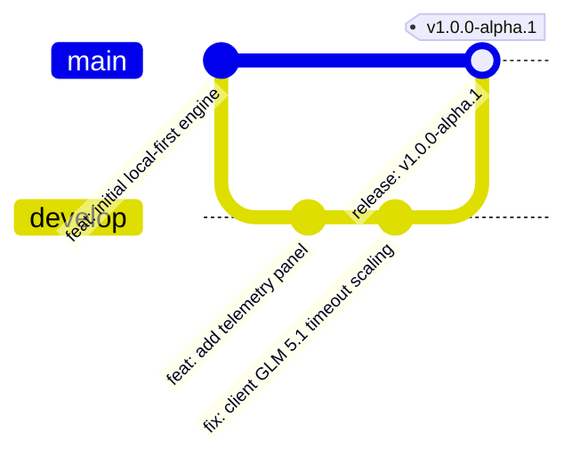

# Operational Launch Playbook: GitHub Release Execution

This document establishes the exact, production-grade operations system for preparing, cleaning, packaging, and releasing the **Neural Arena** codebase onto public GitHub. It acts as a checklist and command reference to ensure zero leakage of private keys, consistent developer onboarding, and a premium open-source presentation.

---

## 1. Authoritative Repository Directory Structure

Before going public, the repository must conform to the structure below. Any stray logs, temporary cache folders, or testing scratch files must be removed.

```
.
├── .github/                       # GitHub Platform Configurations
│   ├── ISSUE_TEMPLATE/            # Automated issue templates
│   │   ├── bug_report.md          # Technical bug report template
│   │   └── feature_request.md     # Structural feature request template
│   ├── workflows/                 # CI/CD pipelines
│   │   └── build-release.yml      # Electron build + compile verification CI
│   └── pull_request_template.md   # PR verification requirements
├── docs/                          # Platform Documentation & Playbooks
│   ├── LAUNCH_SYSTEM/             # Launch execution manuals (this folder)
│   │   ├── LAUNCH_GITHUB_RELEASE.md
│   │   ├── LAUNCH_CINEMATIC_DEMO.md
│   │   ├── LAUNCH_SHORT_FORM_CONTENT.md
│   │   ├── LAUNCH_PUBLIC_POSITIONING.md
│   │   ├── LAUNCH_MONETIZATION.md
│   │   └── LAUNCH_FIRST_90_DAYS.md
│   ├── media/                     # Technical promotional assets & architecture diagrams
│   ├── ARCHITECTURE.md            # Deep-dive on deterministic event-sourcing
│   ├── ADAPTIVE_COGNITION.md      # FSM-driven prompt engineering specification
│   └── TELEMETRY_AND_PRIVACY.md   # Strict data privacy & local-first telemetry rules
├── src/                           # Core Source Code
│   ├── main/                      # Electron Main Process (OS level integrations, file IO)
│   ├── preload/                   # Electron Preload Scripts (Secure bridge)
│   ├── core/                      # Deterministic Simulation Engine & Runner
│   │   ├── api-client.ts          # Resilient multi-provider API connector (GLM 5.1/DeepSeek)
│   │   ├── engine.ts              # Core state transition logic & immutable event-sourcing
│   │   └── types.ts               # Shared types, Event contracts, and state structures
│   └── dashboard/                 # React UI Panel Dashboard (Vite project)
│       ├── src/
│       │   ├── panels/            # Replay Library, Live Telemetry, & Settings panels
│       │   └── state/             # Zustand stores (useReplayLibrary.ts, etc.)
│       └── index.html             # UI Entrypoint
├── package.json                   # Project manifest & build commands
├── tsconfig.json                  # Root TypeScript compiler rules
├── electron-builder.yml           # Electron compilation & packaging configurations
├── LICENSE                        # MIT License
├── CONTRIBUTING.md                # Standard contributor specifications
└── README.md                      # Primary repository landing page
```

---

## 2. Pre-Release Codebase Cleanup & Pruning Checklist

Execute these verification commands sequentially. Do not merge to `main` until every check passes.

### [ ] Step A: Prune Untracked and Ignored Files
Ensure no local cache files, build directories, or IDE telemetry files are left in the working tree. Run the following command from the repository root:
```powershell
# Perform a dry-run to see what will be deleted
git clean -fdxn

# Once verified safe, execute the clean
git clean -fdx
```

### [ ] Step B: Compile Verification
Confirm that TypeScript compile issues are non-existent. The app must compile under strict flags:
```powershell
# Run compiler checks without emitting files
npx tsc --noEmit
```

### [ ] Step C: Dashboard Production Build Validation
Ensure the Vite-based React dashboard bundles correctly into static assets:
```powershell
# Run the dashboard build script
npm run dashboard:build
```

### [ ] Step D: Electron Dry-Run Packaging
Verify that the packaging scripts do not fail due to missing assets or improper paths. Build directory output without generating final installers:
```powershell
# Package Vite dashboard, then compile Electron main/preload to verify release output
npm run build:release -- --dir
```

---

## 3. Commit Strategy & Branching Protections

To maintain project integrity, all contributions must respect the branching structure and conventional commit rules.



### Conventional Commit Specifications
Every commit message must follow this exact format:
`<type>(<scope>): <short summary>`

*   `feat(core)`: Use for engine state changes, deterministic runtime updates, or cognitive prompt modifications.
*   `fix(client)`: Use for resolving API connectors, network drops, or runtime timeout issues (e.g. scale loops).
*   `perf(telemetry)`: Use for improving render speeds of Zustand metrics or telemetry charts.
*   `docs(launch)`: Use for adding launch guidelines, architecture maps, or documentation scripts.
*   `chore(release)`: Update dependency versions, build parameters, or packaging files.

### Branch Protections on GitHub
Enforce the following rules via Repository Settings:
1.  **Branch Protection Rules for `main`**:
    *   Require a Pull Request before merging.
    *   Require approvals (minimum 1 peer review).
    *   Require status checks to pass before merging (`Verify Build & Types` CI pipeline).
    *   Do **NOT** allow force pushes or deletions.
2.  **Use `develop` as the Staging Branch**:
    *   All features and bug fixes must target `develop`.
    *   Only release preparation commits (e.g., updating version numbers) are merged directly from `develop` to `main`.

---

## 4. GitHub Repository Presentation Metadata

The repository's landing presentation must reflect a premium infrastructure tool, not a simple AI wrapper.

### Repository Description
> Local-first simulation runtime and real-time cognition telemetry dashboard for observing, debugging, and benchmarking autonomous AI agents. Deterministic, replayable, and private by design.

### Topics / Tags
Add these exact topics in the GitHub repository settings page:
`autonomous-agents`, `agent-evaluation`, `ai-observability`, `state-machine`, `electron-app`, `typescript`, `deterministic-simulation`, `developer-tools`, `llm-telemetry`, `replay-engine`.

### GitHub Repo Social Preview Image
*   **Dimensions**: 1280 x 640 px (aspect ratio 2:1).
*   **Asset Location**: Save as `docs/media/promotional_banner.png`.
*   **Visual Direction**: Sleek, dark mode dashboard capture with a neon green terminal font overlay reading `[NEURAL ARENA: COGNITIVE OBSERVATION ACTIVE]`. Keep branding subtle and premium.

---

## 5. README Optimization & Visual Asset Requirements

The root `README.md` must be highly engaging and visually descriptive.

### Visual Assets Checklist
*   **Hero Image**: Embed the promotional banner `docs/media/promotional_banner.png` directly under the title header.
*   **Cognitive Self-Correction Demo (GIF)**: High-framerate GIF (15 seconds, 1080p, compressed to under 10MB) showing the agent facing an error, evaluating its trace logs, adjusting its prompt, and executing a successful self-correction move.
*   **Live Scrubber Demonstration (GIF)**: GIF showing a developer clicking and dragging the replay scrubber, driving the chessboard state backward and forward in time.
*   **Telemetry Panel Capture (PNG)**: Still image highlighting the real-time token count, decision latency curves, and dynamic HSL color mappings.

---

## 6. GitHub Release Page Formatting Template

When publishing a release, copy-paste the template below and populate the specific items.

```markdown
# Release v1.0.0-alpha.1 — Autonomous Observability Core

Neural Arena is officially entering its public distribution phase. This release introduces the complete local-first deterministic runtime and cognition pipeline dashboard.

### 🚀 Key Technical Highlights
- **Dynamic Reasoning Scaling**: Integrated adaptive timeouts targeting GLM 5.1, DeepSeek-R1, and OpenAI o1/o3 reasoning models. Automatically scales request bounds up to 360 seconds for extended internal chain-of-thought processing.
- **Deterministic Replay System**: All games write immutable event streams. Import/export execution sequences via structured `.json` packets.
- **Mission Control Dashboard**: Electron-wrapped developer console with real-time token tracking, strategy logs, and state history.

### 📦 Artifact Hashes
Verify the integrity of downloaded binaries before executing:
*   `neural-arena-win-x64-1.0.0-alpha.1.exe`
    *   SHA-256: `INSERT_SHA256_HASH_HERE`
*   `neural-arena-mac-arm64-1.0.0-alpha.1.dmg`
    *   SHA-256: `INSERT_SHA256_HASH_HERE`

### 🔧 Installation & Verification
```bash
# Clone the repository
git clone https://github.com/neural-arena/neural-arena.git
cd neural-arena

# Install dependencies and start the Electron runtime environment
npm install
npm run electron:dev
```

### 🤝 Contributors
Special thanks to the early researchers and engineers who validated the state-machine consistency models.
```

---

## 7. Security Invariants: What MUST NEVER Be Uploaded

To protect user keys and intellectual property, the following files must be blocked explicitly from Git.

> [!CAUTION]
> Uploading production telemetry databases or live model API keys to GitHub will trigger immediate credential compromise alerts. Follow these precautions strictly.

### Explicit Ignored Targets (Checked against `.gitignore`)
1.  **Private Keys & Environment Configurations**:
    *   `.env`, `.env.local`, `.env.development`, `.env.production`
    *   Never commit any hardcoded API strings to `src/core/api-client.ts`.
2.  **Local Run Logs & Cache Folders**:
    *   `src/dashboard/dist/`, `dist/` (build targets)
    *   `*.log`, `npm-debug.log*`, `yarn-error.log*`
    *   `node_modules/`
3.  **Local Runtime Databases**:
    *   `storage/replays/*.json` (unless checked in explicitly as test vectors under `tests/fixtures/`)
    *   SQLite files (`*.sqlite`, `*.db`) used for local tournament tracking.

### Verification Script to Detect Exposed Secrets
Run this query before pushing any changes to remote:
```powershell
# Search for standard API header prefixes in the source tree
git grep -E "sk-|ai_|key=|api_key" -- '*.ts' '*.js' '*.json'
```

---

## 8. Complete Launch Sequencing Workflow

When the codebase is fully stabilized, execute this exact terminal sequence to launch the public release.

```powershell
# 1. Update project versions
npm version 1.0.0-alpha.1 --no-git-tag-version

# 2. Add files and commit release chore
git add package.json package-lock.json
git commit -m "chore(release): bump version to 1.0.0-alpha.1"

# 3. Create tag pointing to the commit
git tag -a v1.0.0-alpha.1 -m "Neural Arena Core Engine Release 1.0.0-alpha.1"

# 4. Push release branch and tags to GitHub
git push origin develop
git push origin v1.0.0-alpha.1

# 5. Run Electron packaging builds to generate installers
npm run build:release

# 6. Check output folder for packaging results
Get-ChildItem -Path .\dist\*.exe, .\dist\*.dmg | Select-Object Name, Length

# 7. Generate SHA-256 validation checksums for release page
Get-FileHash -Path .\dist\neural-arena-setup-*.exe -Algorithm SHA256
```

Upload the generated executable and installer files from `.\dist\` directly to the draft GitHub Release page, paste the formatting template, and click **Publish Release**.
